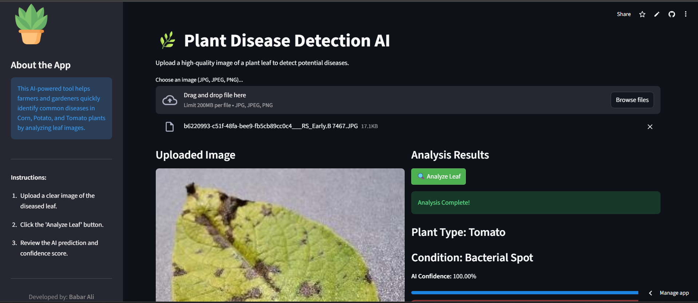

# 🌿 Plant Disease Prediction AI


An advanced, AI-powered web application designed to help farmers, gardeners, and agricultural researchers quickly identify common diseases in plant leaves. Built with a Deep Learning model and deployed via Streamlit, this tool provides instant predictions and confidence scores.

### 🚀 **[Try the Live Demo Here!](https://ai-plant-disease-prediction-app.streamlit.app/)**

---

## 📸 App Preview



---

## ✨ Features

* **Fast & Accurate Detection:** Upload an image of a leaf and get instant results.
* **Confidence Scoring:** Displays the AI's confidence percentage for its prediction.
* **Actionable Insights:** Provides basic recommended actions based on the detected condition.
* **Premium UI:** A clean, responsive, and user-friendly interface.
* **Cloud Hosted:** Accessible anywhere via the Streamlit Cloud deployment.

## 🍃 Supported Plants & Diseases

Currently, the model is trained to classify the following conditions:
1.  🌽 **Corn** - Common Rust
2.  🥔 **Potato** - Early Blight
3.  🍅 **Tomato** - Bacterial Spot

---

## 💻 Running the Project Locally

If you want to run this app on your own machine, follow these steps:

### 1. Clone the Repository
```bash
git clone [https://github.com/babaralimahar/Plant_Disease_Prediction_App.git](https://github.com/babaralimahar/Plant_Disease_Prediction_App.git)
cd Plant_Disease_Prediction_App
